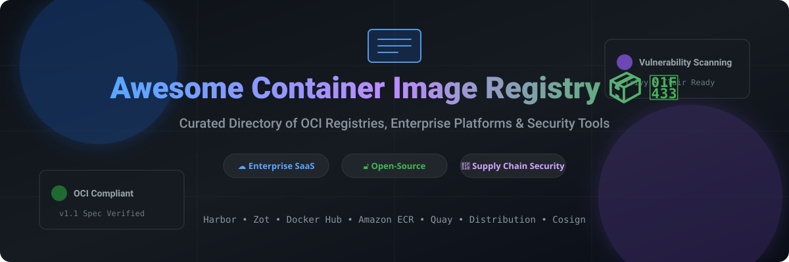

# Awesome-Container-Image-Registry

# Awesome-Container-Image-Registry 📦 🐳



  





  
  
  
  
  
  



---

## 🌟 Top Container Image Registry Ecosystem

**Curated List of Commercial Container Registries & Open-Source Registry Platforms**  
*Focused on OCI-Compliant Storage, Vulnerability Scanning, Image Signing, Multi-Architecture Support, Replication & Self-Hosted Registries*

**Last updated: October 2026** 📅

---

### 📌 Overview & SEO Summary
Welcome to the ultimate curated directory of **container image registries**, **open-source OCI artifact repositories**, and **image signing frameworks**. Whether you are looking for enterprise-grade commercial solutions (such as *Amazon ECR*, *Docker Hub*, and *JFrog Artifactory*), or self-hostable open-source alternatives (like *Harbor*, *Zot*, and *Distribution*), this list covers category leaders, supply chain security, and privacy-respecting artifact storage.

**Key Market Context:**
- **Harbor** is the **most widely deployed open-source registry**, a **CNCF Graduated project** with **25K+ GitHub stars**, offering **vulnerability scanning, signing, and replication** out of the box .
- **Zot** is the **fastest-growing OCI-native registry**, built on **OCI Distribution Spec v1.1** with **built-in vulnerability scanning** and **no database dependency** .
- **Distribution (Docker Registry v2)** remains the **reference implementation** of the OCI Distribution Spec, powering Docker Hub, GitHub Container Registry, and most cloud registries .

---

## 📑 Table of Contents
- [🏢 SaaS & Commercial Platforms](#-saas--commercial-platforms)
- [🔓 Open-Source GitHub Projects](#-open-source-github-projects)
- [🛠️ How to Contribute](#%EF%B8%8F-how-to-contribute)
- [📊 Star History](#-star-history)
- [🤝 Support & Sponsorship](#-support--sponsorship)
- [⚠️ Disclaimer](#%EF%B8%8F-disclaimer)

---

## 🏢 SaaS / Commercial Platforms

The container image registry market spans **hyperscaler registries** (ECR, GAR, ACR) that integrate deeply with their cloud platforms, **developer-first registries** (Docker Hub, GitHub Packages, GitLab Registry) that emphasize ease of use, and **enterprise artifact platforms** (JFrog Artifactory, Cloudsmith, Quay) that offer **multi-format support and advanced governance**. **Amazon ECR** charges **$0.10/GB/month for storage** and **$0.09/GB for data transfer out** . **Docker Hub** offers **free public repositories** with **rate limits** (200 pulls/6 hours for anonymous, 5,000 for authenticated) and **paid plans from $9/month** . **Google Artifact Registry** charges **$0.10/GB/month** . **Azure Container Registry** starts at **$5/month for Basic** . **GitHub Packages** offers **free storage and transfer** for public packages, with **usage-based pricing** for private . **JFrog Artifactory** uses **custom enterprise pricing** .

| SaaS / Commercial Platform | Company / Owner | Valuation / Market Cap | Standard Edition Starting Price | Free Tier / Free Trial Limits | Description |
| :--- | :--- | :--- | :--- | :--- | :--- |
| **[Amazon Elastic Container Registry (ECR)](https://aws.amazon.com/ecr/)** ☁️ | Amazon | ~$2.0 Trillion | **$0.10/GB/month** storage; **$0.09/GB** data transfer out  | **Free tier: 500 MB/month for 12 months**  | **AWS-native container registry** — **Private and public repositories** . **Image scanning** on push with **Inspector integration** . **Cross-region replication** and **pull-through cache** for Docker Hub . **IAM-based access control** and **VPC endpoints** . **Deep integration** with ECS, EKS, and Lambda . |
| **[Docker Hub](https://hub.docker.com/)** 🐳 | Docker Inc. | Private | **Pro: $9/month**; **Team: $15/user/month**; **Business: $24/user/month**  | **Free: unlimited public repos, 1 private repo**  | **The default container registry** — **15M+ container images** . **Official Images and Verified Publisher** programs . **Automated builds and webhooks** . **Rate limits**: 200 pulls/6 hours anonymous, 5,000 authenticated . **The most widely used registry** — default for Docker CLI and Kubernetes . |
| **[Google Artifact Registry](https://cloud.google.com/artifact-registry)** 🌐 | Google (Alphabet) | ~$2.0 Trillion | **$0.10/GB/month** storage  | **Free tier: 0.5 GB/month**  | **GCP-native artifact registry** — **Container images, language packages, and OS packages** . **Vulnerability scanning** with **Container Analysis** . **IAM integration** and **VPC Service Controls** . **Replaces Container Registry (GCR)** . |
| **[Azure Container Registry (ACR)](https://azure.microsoft.com/en-us/products/container-registry/)** 🔷 | Microsoft | ~$3.90 Trillion | **Basic: $5/month**; **Standard: $20/month**; **Premium: $50/month**  | **Free tier: limited** | **Azure-native container registry** — **Geo-replication** in Premium tier . **Content trust** for image signing . **ACR Tasks** for automated builds . **Private link** and **customer-managed keys** . **Integrated with AKS, ACI, and App Service** . |
| **[GitHub Packages](https://github.com/features/packages)** 🐙 | Microsoft / GitHub | ~$3.90 Trillion | **Free for public packages**; **usage-based for private**  | **Free: 500 MB storage, 1 GB transfer/month**  | **GitHub-native package registry** — **Container images, npm, Maven, NuGet, and RubyGems** . **Integrated with GitHub Actions** . **Free for public packages** . **Rate limits and storage quotas** apply for private . |
| **[Quay.io](https://quay.io/)** 🔴 | Red Hat | ~$50 Billion (IBM) | **Custom pricing** (Red Hat subscription) | **Free: public repositories**  | **Enterprise container registry** — **Vulnerability scanning** with **Clair** . **Image signing and verification** . **Team-based access control** . **Geo-replication** . **Used by Red Hat OpenShift** as the default registry . |
| **[JFrog Artifactory](https://jfrog.com/artifactory/)** 🐸 | JFrog | ~$5 Billion | **Custom enterprise pricing**  | **Free trial available** | **Universal artifact repository** — **Container images, Maven, npm, PyPI, and more** . **Xray** for security scanning . **High availability and geo-replication** . **The most comprehensive artifact platform** . |
| **[Cloudsmith](https://cloudsmith.com/)** 📦 | Cloudsmith | Private | **Custom pricing**; **free tier for open-source**  | **Free tier for open-source projects**  | **Cloud-native artifact management** — **Container images, Helm, npm, and more** . **Entitlement tokens** for distribution . **SBOM generation and vulnerability scanning** . **Used by DataHub** for branded image distribution . |
| **[GitLab Container Registry](https://docs.gitlab.com/ee/user/packages/container_registry/)** 🦊 | GitLab | ~$8 Billion | **Free tier with GitLab subscription**  | **Free: 5 GB storage**  | **GitLab-native container registry** — **Integrated with GitLab CI/CD** . **Image scanning** with **GitLab Ultimate** . **Cleanup policies** for storage management . |
| **[Harbor Cloud (Commercial)](https://goharbor.io/)** ⚓ | VMware (Broadcom) | ~$60 Billion | **Custom pricing** (VMware Tanzu) | **Harbor OSS free forever**  | **Enterprise Harbor distribution** — **Commercial support and advanced features** . **VMware Tanzu integration** . **Based on the open-source Harbor project** . |

---

## 🔓 Open-Source GitHub Projects

*Sorted by GitHub_Stars_Count (Descending)* 🌟

- **[Harbor](https://github.com/goharbor/harbor)**   
  **The most widely deployed open-source container registry**, Apache-2.0 licensed. **25K+ GitHub stars** — **CNCF Graduated project** . **The enterprise-grade registry** — **vulnerability scanning** with Trivy and Clair, **image signing** with Notary and Cosign, **RBAC**, **LDAP/AD integration**, **replication** across registries, and **garbage collection** . **Web UI** for management and auditing . **Helm chart deployment** for Kubernetes . **The definitive open-source registry** — used by enterprises worldwide for private container image management . ⚓

- **[Zot](https://github.com/project-zot/zot)**   
  **OCI-native container image registry**, Apache-2.0 licensed. **The fastest-growing OCI-native registry** — **built on OCI Distribution Spec v1.1** . **No database dependency** — uses **filesystem or S3-compatible storage** . **Built-in vulnerability scanning** with Trivy . **Image signing and verification** with Cosign . **Multi-architecture support** . **Sync** with other registries . **Metrics** via Prometheus . **The most modern open-source registry** — designed for cloud-native environments . 🚀

- **[Distribution (Docker Registry v2)](https://github.com/distribution/distribution)**   
  **The reference implementation of the OCI Distribution Spec**, Apache-2.0 licensed. **The foundation of container image distribution** — powers **Docker Hub, GitHub Container Registry, and most cloud registries** . **Storage drivers** for filesystem, S3, GCS, Azure Blob, and more . **Webhook notifications** . **Token-based authentication** . **The most widely deployed registry implementation** — every cloud registry is built on this or a fork . 🏛️

- **[Dragonfly](https://github.com/dragonflyoss/dragonfly)**   
  **P2P-based image and file distribution system**, Apache-2.0 licensed. **CNCF Incubating project** — **peer-to-peer distribution** for container images . **Reduces registry bandwidth** by **up to 90%** . **Used by Alibaba, ByteDance, and other large-scale deployments** . 🐉
  
- **[Distribution (CNCF Sandbox)](https://github.com/distribution/distribution)**   
  **The reference OCI Distribution implementation**, Apache-2.0 licensed. **The standard registry implementation** — every cloud registry builds on this or forks it . **Storage drivers for filesystem, S3, GCS, Azure, and more** . **Webhook notifications and token auth** . 🏛️

- **[Cosign (Sigstore)](https://github.com/sigstore/cosign)**   
  **Container image signing and verification**, Apache-2.0 licensed. **The standard for image signing** — **keyless signing with OIDC** . **Attestations and SBOMs** . **Integrates with Kubernetes admission controllers** . **The supply chain security foundation for container registries** . 🔐

- **[Trivy](https://github.com/aquasecurity/trivy)**   
  **Comprehensive security scanner for containers**, Apache-2.0 licensed. **The default vulnerability scanner** for **Harbor, Zot, and most registries** . **Scans OS packages, language dependencies, IaC, and secrets** . **Used by thousands of organizations** for container security . 🐟

- **[Skopeo](https://github.com/containers/skopeo)**   
  **Work with remote container images**, Apache-2.0 licensed. **Copy, inspect, and sign images** between registries . **No Docker daemon required** . **The standard tool for registry-to-registry image operations** . 🛠️

- **[Crane](https://github.com/google/go-containerregistry)**   
  **Go library and CLI for container registry operations**, Apache-2.0 licensed. **Inspect, copy, and manipulate images** . **The standard Go library for registry integration** . 🏗️

---

## 🛠️ How to Contribute

Contributions are welcome! Follow these steps to submit new container registries or open-source registry software:

1. 🍴 **Fork** the repository.
2. 📝 **Add/edit** entries in `README.md` maintaining table/list structure and formatting.
3. 🔗 Include project title, official website/GitHub link, exact Stars_Count, license, and brief description.
4. 🚀 Submit a **Pull Request** with a descriptive summary of your changes.

---

## 📊 Star History



---

## 🤝 Support & Sponsorship

If you find this container image registry repository useful, please consider supporting the project:

- ⭐ **Star** this repository to increase visibility!
- 🔀 **Fork** and share with fellow DevOps engineers, platform teams, and open-source advocates.
- ☕ **Sponsor & Buy Me a Coffee**: Support ongoing open-source curation via the [GitHub Sponsor Dashboard](https://github.com/sponsors/ishandutta2007).

---

## ⚠️ Disclaimer

- This is a **community-curated** list — not exhaustive and not an endorsement. ℹ️
- **Harbor is the most widely deployed open-source registry** — **25K+ GitHub stars**, **CNCF Graduated**, with **vulnerability scanning, signing, and replication** built in . **Zot is the fastest-growing OCI-native registry** with **no database dependency** .
- **Docker Hub rate limits**: **200 pulls/6 hours anonymous**, **5,000 pulls/6 hours authenticated** . **Paid plans from $9/month** .
- **Amazon ECR charges $0.10/GB/month** for storage and **$0.09/GB** for data transfer out . **Google Artifact Registry charges $0.10/GB/month** . **Azure ACR Basic is $5/month** .
- **Open-source registries (Harbor, Zot, Distribution) are not turnkey** — they require **deployment, storage configuration, and ongoing maintenance** . **Always validate registry performance and security with a proof-of-concept** before production deployment . 📦

---



  <b>Made with ❤️ for DevOps engineers, platform teams, and open-source container registry advocates.</b>

